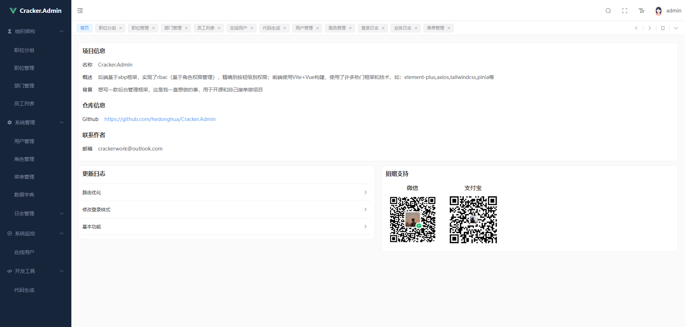
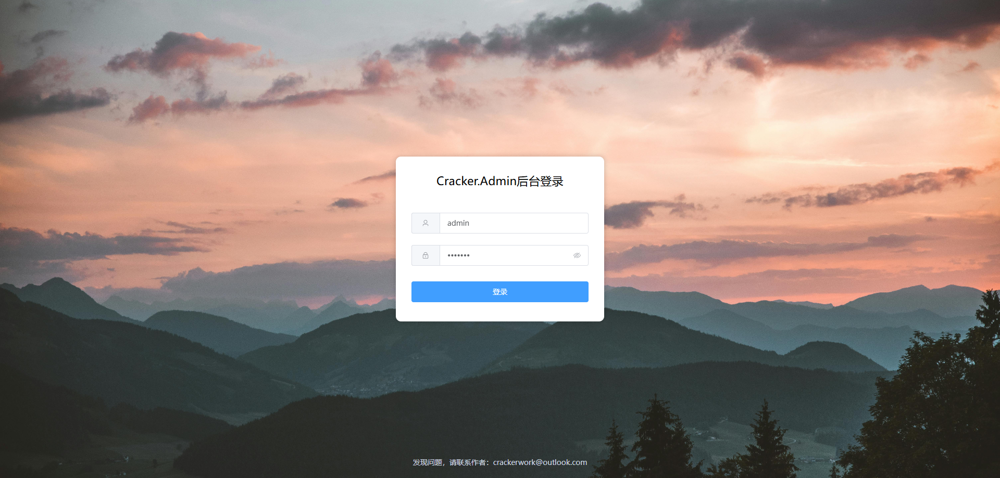
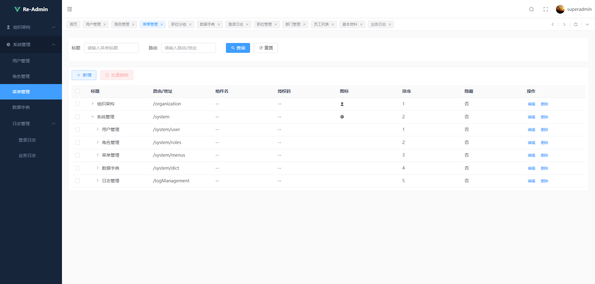
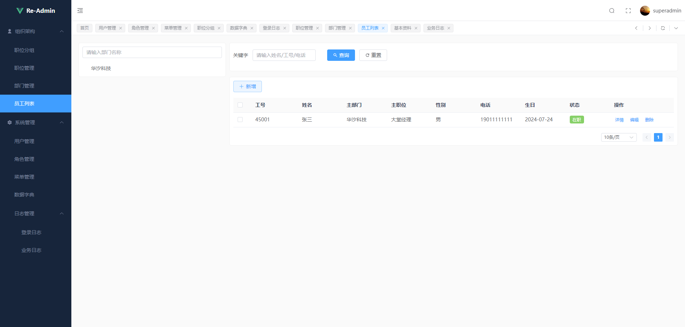
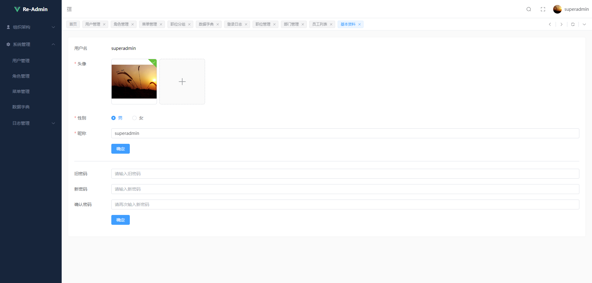
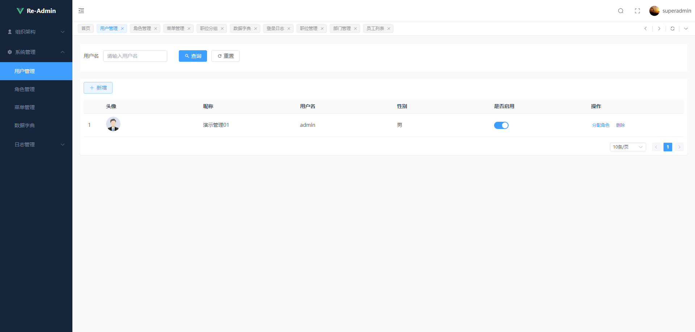

# Cracker.Admin

前端使用re-admin（自己写的前端框架，不依赖任何admin框架），后端基于abp框架，实现了rbac（基于角色权限访问控制）通用权限管理，精确到按钮级别的权限控制。

<!-- PROJECT SHIELDS -->

[![Forks][forks-shield]][forks-url]
[![Stargazers][stars-shield]][stars-url]
[![Issues][issues-shield]][issues-url]
[![MIT License][license-shield]][license-url]

### 在线预览

预览地址： http://admin.crackerwork.cn/
账号： admin
密码： 123qwe*

### 项目截图

### 开发环境

* .NET8+
* NodeJs18+

### 使用技术

* NETCore
* .Abp
* MySQL
* Redis
* EntityFrameworkCore
* Dapper
* JWT
* Coravel
* AutoMapper
* Serilog
* IP2Region.Net
* MQTT
* Vue
* Vite
* TypeScript
* MockJs
* VueRouter
* Pinia
* Lodash
* Axios
* DayJs
* ElementUI Plus
* Sass
* Iconify
* TailwindCSS

###### **使用步骤**

1. 数据库

新建cracker_admin数据库，执行根目录下`cracker_admin.sql`

2. 前端依赖下载

`pnpm install`

### 作者

crackerwork@outlook.com

QQ: 1491184849

MySite: http://crackerwork.cn

### 版权说明

该项目签署了MIT 授权许可，详情请参阅 [LICENSE.txt][license-url]

<!-- links -->
[forks-shield]: https://img.shields.io/github/forks/hedonghua/Cracker.Admin.svg?style=flat-square
[forks-url]: https://github.com/hedonghua/Cracker.Admin/network/members
[stars-shield]: https://img.shields.io/github/stars/hedonghua/Cracker.Admin.svg?style=flat-square
[stars-url]: https://github.com/hedonghua/Cracker.Admin/stargazers
[issues-shield]: https://img.shields.io/github/issues/hedonghua/Cracker.Admin.svg?style=flat-square
[issues-url]: https://img.shields.io/github/issues/hedonghua/Cracker.Admin.svg
[license-shield]: https://img.shields.io/github/license/hedonghua/Cracker.Admin.svg?style=flat-square
[license-url]: https://github.com/hedonghua/Cracker.Admin/blob/master/LICENSE.txt

